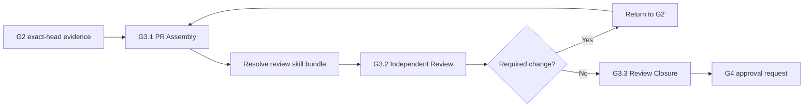

# GWC G3 Skill

## Purpose

Operate the existing GWC G3 delivery mechanism consistently. G3 asks whether the exact current Draft PR head is independently reviewed, validated, CI-verified, acceptance-criteria-complete, and safe to present for a separate G4 merge decision.

This skill reuses `tools/validate_g3_delivery.py`, `schemas/g3-delivery-record.schema.json`, `templates/gates/g3-delivery-record.template.yaml`, and `tests/test_g3_delivery.py`. Do not create a parallel G3 artifact or lifecycle.

## Authority boundary

G3 may create or update a Draft PR when authorized, assemble the delivery record, record a read-only review, verify CI for the exact current head SHA, close findings, and generate a G4 approval request after G3 PASS.

Do not merge, enable auto-merge, mark ready for review, deploy, release, touch production configuration, perform credential operation, run migration, access production data, direct-push to protected branches, force-push, delete branches, rewrite shared history, or change PR base. Reviewer PASS is evidence only.

## Existing flow



## Skill source resolution

Use Context7 first with exact library ID:

```text
/obra/superpowers
```

Resolution order:

```text
1. Query Context7 for latest compatible review guidance.
2. Confirm the complete G3-compatible bundle is present.
3. If Context7 is forbidden, unavailable, timeout, empty, incomplete, or incompatible, load libs/g3-skill-library/.
4. Verify every offline file against libs/g3-skill-library/manifest.yaml.
5. If neither source is valid, stop with G3_SKILL_SOURCE_BLOCKED.
```

Context7 is attempted before reading offline skill contents. When the exact library ID is known, direct `query-docs` is acceptable.

### Retry policy

- `forbidden` or hard `unavailable`: fallback immediately.
- `timeout`: retry once, then fallback.
- `empty_result`, `incomplete_bundle`, or `incompatible_bundle`: retry once with deeper research when available, then fallback.
- Never exceed two live queries for one G3 run.

### bundle-atomic rule

A G3 run uses exactly one source mode:

```text
CONTEXT7_LIVE
or
OFFLINE_PINNED
```

Do not mix live and offline skill cards. Record `source_mix: NONE`.

### Required compatible skills

The bundle is complete only when it covers:

- `requesting-code-review`;
- `verification-before-completion`;
- `receiving-code-review`;
- `finishing-development-branch-pr-only`;
- optional `dispatching-parallel-review`.

## G3.1 PR Assembly

Verify repository, base SHA, guarded branch, exact current head SHA, scope hash, changed paths, validation output, CI status, acceptance criteria, and exclusions. Any head SHA change makes prior validation, CI, and review stale.

## G3.2 Independent Review

Reviewer must be independent from implementer and operate read-only. Review lanes: requirement, design, code, test, governance, delivery, CI. Findings use BLOCKER, MAJOR, MINOR, or NIT.

## G3.3 Review Closure

- BLOCKER: return to G2.
- MAJOR: fix in G2 or capture exact-head human risk acceptance.
- MINOR: fix or defer with traceable follow-up.
- NIT: record as non-blocking.

Run `tools/validate_g3_delivery.py` before claiming G3 PASS. If PASS, prepare a G4 approval request; do not merge.
