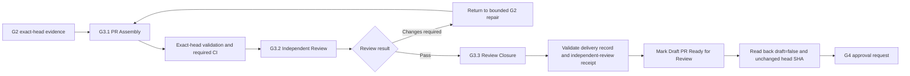

# GWC G3 Skill

## Purpose

Operate the existing GWC G3 delivery mechanism consistently. G3 asks whether the exact current Draft PR head is independently reviewed through a capability-supported read-only reviewer source, validated, CI-verified, acceptance-criteria-complete, and safe to promote to Ready for Review for a separate G4 merge decision.

This skill reuses `tools/validate_g3_delivery.py`, `schemas/g3-delivery-record.schema.json`, `templates/gates/g3-delivery-record.template.yaml`, and `tests/test_g3_delivery.py`. It extends that evidence with the additive independent-review receipt:

```text
.gwc/tasks/<task-id>/g3/code-review-invocation.json
```

The receipt must validate with `tools/validate_g3_review_invocation.py` against `schemas/g3-code-review-invocation.schema.json`. It is supplemental G3 evidence, not a parallel gate or approval.

## Authority boundary

G3 may create or update a Draft PR when authorized, assemble the delivery record, obtain one independent read-only review, verify CI for the exact current head SHA, close findings, validate both G3 evidence records, and mark the same Draft PR Ready for Review after every guard passes.

Do not merge or enable auto-merge in G3. Ready-for-Review promotion is G3 metadata completion. It does not deploy, release, publish, reload runtime, touch production configuration, perform credential operations, run migrations, access production data, direct-push to protected branches, force-push, delete branches, rewrite shared history, or change the PR base.

## Canonical flow


```mermaid
flowchart LR
    A[G2 exact-head evidence] --> B[G3.1 PR Assembly]
    B --> C[Exact-head validation and required CI]
    C --> D[G3.2 Independent Review]
    D --> E{Review result}
    E -- Changes required --> F[Return to bounded G2 repair]
    F --> B
    E -- Pass --> G[G3.3 Review Closure]
    G --> H[Validate delivery record and independent-review receipt]
    H --> I[Mark Draft PR Ready for Review]
    I --> J[Read back draft=false and unchanged head SHA]
    J --> K[G4 approval request]
```

Review PASS alone does not transition the task to `merge_pending`. Only successful Ready-for-Review promotion and readback may do that.

## Skill source resolution

Use Context7 first with exact library ID:

```text
/obra/superpowers
```

Context7 is attempted before reading the offline skill contents.

Resolution order:

```text
1. Query Context7 for latest compatible review guidance.
2. Confirm the complete G3-compatible bundle is present.
3. If Context7 is forbidden, unavailable, timeout, empty, incomplete, or incompatible, load libs/g3-skill-library/.
4. Verify every offline file against libs/g3-skill-library/manifest.yaml.
5. If neither source is valid, stop with G3_SKILL_SOURCE_BLOCKED.
```

### bundle-atomic rule

A G3 run uses exactly one source mode:

```text
CONTEXT7_LIVE
or
OFFLINE_PINNED
```

Do not mix bundles. The required compatible skill composition is:

- `requesting-code-review`;
- `verification-before-completion`;
- `receiving-code-review`;
- `finishing-development-branch-pr-only`;
- optional `dispatching-parallel-review`.

## G3.1 PR Assembly

Verify repository, base SHA, guarded branch, exact current head SHA, scope hash, changed paths, validation output, required CI status, acceptance criteria, and exclusions. Create or update the Pull Request as Draft. Any head SHA change makes prior validation, CI, review, and readiness evidence stale.

## G3.2 Independent Review

Select the reviewer source from verified runtime capability:

```text
local_agent or repo_ci with independent reviewer runtime
  -> reviewer.kind=agent
  -> reviewer.role=code_reviewer

chat_connector_only without independent-agent capability
  -> reviewer.kind=human
  -> reviewer.role=human_reviewer
```

The human path is a capability fallback, not a waiver. It requires an explicit independent human review decision bound to the exact current PR head SHA. A plain acknowledgement such as `next`, `continue`, `ok`, or `go to G4` is not review evidence.

Never fabricate an agent invocation, relabel the implementer's self-review as independent, or claim that conversation reasoning produced a separate reviewer. The reviewer must differ from the implementer and operate read-only.

Bind the request and result to the same task, repository, PR number, head SHA, and scope hash used by the delivery record. The evidence must record:

- implementer ID and reviewer ID;
- reviewer kind, role, and independence mode;
- provider and invocation or review ID;
- requested and completed timestamps;
- requested and completed head SHA;
- traceable result reference;
- result, findings, stale state, and an empty `write_actions` list.

An agent may use `independent` or honestly labelled `fresh-context`. A human reviewer must use `independent`. A reviewer that performs a repository write loses independence; the changed head must return to validation and be reviewed again by another read-only reviewer.

Validate the receipt:

```text
python tools/validate_g3_review_invocation.py \
  --record .gwc/tasks/<task-id>/g3/code-review-invocation.json
```

## G3.3 Review Closure

- `BLOCKER`: return to G2.
- `MAJOR`: fix in G2 or capture exact-head human risk acceptance in the delivery record.
- `MINOR`: fix or defer with traceable follow-up.
- `NIT`: record as non-blocking.

Run both validators before claiming review closure:

```text
python tools/validate_g3_review_invocation.py --record .gwc/tasks/<task-id>/g3/code-review-invocation.json
python tools/validate_g3_delivery.py --record .gwc/tasks/<task-id>/g3/delivery-record.yaml
```

## Ready-for-Review promotion

Promotion is allowed only when all of the following are true for the same current PR head SHA:

- the PR is open and Draft;
- local/applicable validation passed;
- every required CI check passed;
- an agent or human independent-review receipt passed and is not stale;
- the delivery record passed and has no unresolved blocker;
- acceptance criteria are complete;
- scope drift is false;
- no prohibited action occurred.

Invoke `mark_pull_request_ready_for_review`, then read the PR back. Promotion passes only when:

```text
observed draft == false
observed state == open
observed head SHA == reviewed head SHA
```

Store the review and promotion/readback receipts in the PR timeline, GitHub Check, Actions artifact, or append-only audit event. Do not commit a post-review or post-promotion receipt to the reviewed PR branch because that would change the head SHA and stale the review.

After successful readback, transition the work state to `merge_pending` and prepare the exact G4 approval request. If review evidence, promotion, or readback fails, remain in G3 and report `G3_READY_FOR_REVIEW_BLOCKED`; do not generate a merge-ready G4 request.
