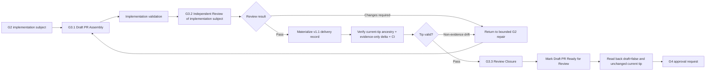

# GWC G3 Skill

## Purpose

Operate the existing GWC G3 delivery mechanism consistently without making a
committed evidence artifact self-reference its own container commit.

G3 asks two related questions:

1. Is the immutable implementation subject independently reviewed and validated?
2. Is the exact current Draft PR tip a trusted descendant containing only
   task-scoped G3 evidence after that implementation subject, with required CI
   passing at the exact current head SHA?

The canonical v1.1 `g3/delivery-record.yaml` binds the implementation subject.
The current PR tip, ancestry proof, evidence-delta paths, and current-tip CI are
trusted runtime facts supplied when the record is validated. The committed
record must not embed a mandatory SHA for the commit containing itself.

This skill reuses `tools/validate_g3_delivery.py`,
`schemas/g3-delivery-record.schema.json`,
`templates/gates/g3-delivery-record.template.yaml`, and
`tests/test_g3_delivery.py`. It extends that evidence with the additive
independent-review receipt:

```text
.gwc/tasks/<task-id>/g3/code-review-invocation.json
```

The receipt must validate with `tools/validate_g3_review_invocation.py` against
`schemas/g3-code-review-invocation.schema.json`. It is supplemental G3 evidence,
not a parallel gate or approval. Post-review receipts that would change the PR
tip must be stored externally (PR timeline, check, Actions artifact, or audit
event) unless the active contract explicitly treats them as evidence-only and
recomputes current-tip evidence afterward.

## Authority boundary

G3 may create or update a Draft PR when authorized, assemble the delivery
record, obtain one independent read-only review, verify exact-current-tip
ancestry/evidence-only drift/CI, close findings, validate G3 evidence, and mark
the same Draft PR Ready for Review after every guard passes.

Do not merge or enable auto-merge in G3. Ready-for-Review promotion is G3
metadata completion. It does not deploy, release, publish, reload runtime, touch
production configuration, perform credential operations, run migrations, access
production data, direct-push to protected branches, force-push, delete branches,
rewrite shared history, or change the PR base.

## Canonical flow


```mermaid
flowchart LR
    A[G2 implementation subject] --> B[G3.1 Draft PR Assembly]
    B --> C[Implementation validation]
    C --> D[G3.2 Independent Review of implementation subject]
    D --> E{Review result}
    E -- Changes required --> F[Return to bounded G2 repair]
    F --> B
    E -- Pass --> G[Materialize v1.1 delivery record]
    G --> H[Verify current-tip ancestry + evidence-only delta + CI]
    H --> I{Tip valid?}
    I -- Non-evidence drift --> F
    I -- Pass --> J[G3.3 Review Closure]
    J --> K[Mark Draft PR Ready for Review]
    K --> L[Read back draft=false and unchanged current tip]
    L --> M[G4 approval request]
```

Review PASS alone does not transition the task to `merge_pending`. Only
successful Ready-for-Review promotion and readback may do that.

## Skill source resolution

Use Context7 first with exact library ID:

```text
/obra/superpowers
```

Context7 is attempted before reading the offline skill contents.

Resolution order:

```text
1. Query Context7 for latest compatible review guidance.
2. Confirm the complete G3-compatible bundle is present.
3. If Context7 is forbidden, unavailable, timeout, empty, incomplete, or incompatible, load libs/g3-skill-library/.
4. Verify every offline file against libs/g3-skill-library/manifest.yaml.
5. If neither source is valid, stop with G3_SKILL_SOURCE_BLOCKED.
```

### bundle-atomic rule

A G3 run uses exactly one source mode:

```text
CONTEXT7_LIVE
or
OFFLINE_PINNED
```

Do not mix bundles. The required compatible skill composition is:

- `requesting-code-review`;
- `verification-before-completion`;
- `receiving-code-review`;
- `finishing-development-branch-pr-only`;
- optional `dispatching-parallel-review`.

## G3.1 PR Assembly

Verify repository, base SHA, guarded branch, implementation subject SHA, scope
hash, changed paths, validation output, acceptance criteria, and exclusions.
Create or update the Pull Request as Draft.

Record the implementation subject before adding G3 evidence. The canonical v1.1
record uses `implementation_head_sha`; it does not store a self-referential
current-tip SHA. A later evidence-only tip does not change the implementation
subject.

## G3.2 Independent Review

Select the reviewer source from verified runtime capability:

```text
local_agent or repo_ci with independent reviewer runtime
  -> reviewer.kind=agent
  -> reviewer.role=code_reviewer

chat_connector_only without independent-agent capability
  -> reviewer.kind=human
  -> reviewer.role=human_reviewer
```

The human path is a capability fallback, not a waiver. It requires an explicit
independent human review decision bound to the implementation subject SHA and
scope hash. A plain acknowledgement such as `next`, `continue`, `ok`, or `go to
G4` is not review evidence.

Never fabricate an agent invocation, relabel the implementer's self-review as
independent, or claim that conversation reasoning produced a separate reviewer.
The reviewer must differ from the implementer and operate read-only.

Bind implementation review evidence to the same task, repository, PR number,
`implementation_head_sha`, and scope hash used by the delivery record. Record:

- implementer ID and reviewer ID;
- reviewer kind, role, and independence mode;
- provider and invocation or review ID;
- requested and completed timestamps;
- reviewed implementation subject SHA;
- traceable result reference;
- result, findings, stale state, and an empty `write_actions` list.

An agent may use `independent` or honestly labelled `fresh-context`. A human
reviewer must use `independent`. A reviewer that performs a repository write
loses independence; implementation mutation must return to G2 and be reviewed
again by another read-only reviewer.

Validate any committed invocation receipt according to its active schema. Do not
use a receipt that requires embedding the SHA of its own containing commit.

## External current-tip verification

For v1.1 `outcome=pass`, resolve trusted repository facts after the implementation
review and after task-scoped G3 evidence has been materialized:

- exact current PR head SHA;
- proof that `implementation_head_sha` is equal to or an ancestor of that tip;
- aggregate changed paths from implementation subject to current tip;
- exact-current-tip results for every required CI check.

The only default post-implementation paths allowed are:

```text
.gwc/tasks/<task-id>/g3/**
```

Any source, test, workflow, dependency, runtime, configuration, or unrelated
governance path in that delta is non-evidence drift and returns to G2.

An evidence-only new current tip makes prior tip-level ancestry/delta/CI evidence
stale and requires recomputation. It does not stale implementation validation or
review when the implementation subject and scope are unchanged.

## G3.3 Review Closure

- `BLOCKER`: return to G2.
- `MAJOR`: fix in G2 or capture human risk acceptance bound to the exact
  implementation subject SHA.
- `MINOR`: fix or defer with traceable follow-up.
- `NIT`: record as non-blocking.

Validate the delivery record with trusted current-tip context. Example:

```text
python tools/validate_g3_delivery.py \
  --record .gwc/tasks/<task-id>/g3/delivery-record.yaml \
  --current-pr-head <current-pr-head> \
  --implementation-ancestor-verified \
  --evidence-delta-path .gwc/tasks/<task-id>/g3/delivery-record.yaml \
  --ci-check validate-instructions=pass
```

Supply every actual evidence-delta path and every required check declared by the
record. Do not infer CI PASS when CI is unavailable.

Historical v1.0 records are immutable provenance. For a new active G3 closure,
materialize/migrate a v1.1 record rather than silently reinterpreting v1.0.

## Ready-for-Review promotion

Promotion is allowed only when all of the following are true:

- the PR is open and Draft;
- implementation validation passed for `implementation_head_sha`;
- independent implementation review passed and is not stale;
- implementation subject ancestry to the exact current PR tip is verified;
- the aggregate post-implementation delta is task-scoped G3 evidence only;
- every required CI check passed at the exact current PR tip;
- the v1.1 delivery record passed with trusted runtime context;
- acceptance criteria are complete;
- no prohibited action occurred.

Invoke `mark_pull_request_ready_for_review`, then read the PR back. Promotion
passes only when:

```text
observed draft == false
observed state == open
observed head SHA == externally verified current PR head SHA
```

Store promotion/readback and final tip-level receipts in the PR timeline, GitHub
Check, Actions artifact, or append-only audit event. Do not commit a final
current-tip receipt that embeds its own containing commit SHA.

After successful readback, transition the work state to `merge_pending` and
prepare the exact G4 approval request. If implementation review, external tip
validation, promotion, or readback fails, remain in G3 and report
`G3_READY_FOR_REVIEW_BLOCKED`; do not generate a merge-ready G4 request.
